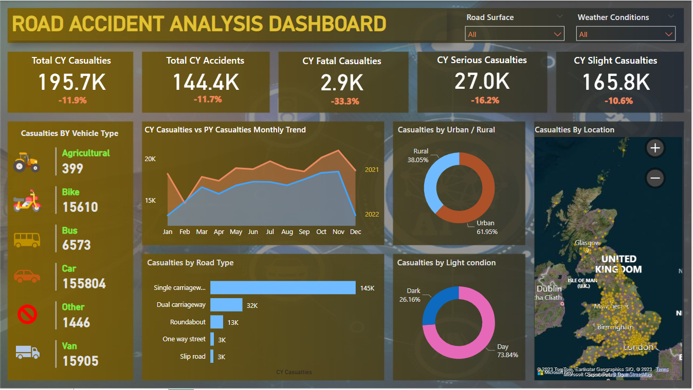

# PowerBI-Road-Accident-Analysis
Interactive Power BI dashboard for analyzing road accident trends, casualties, locations, and vehicle types.
# Road Accident Analysis Dashboard

## Overview

This Power BI dashboard analyzes road accident data to monitor casualties, accident trends, road conditions, weather conditions, and geographical distribution.

## Features

- KPI Cards
- Monthly Trend Analysis
- Vehicle Type Analysis
- Urban vs Rural Analysis
- Road Type Analysis
- Interactive Map
- Dynamic Filters

## Tools Used

- Power BI
- DAX
- Power Query
- Data Visualization

## Dashboard Preview

